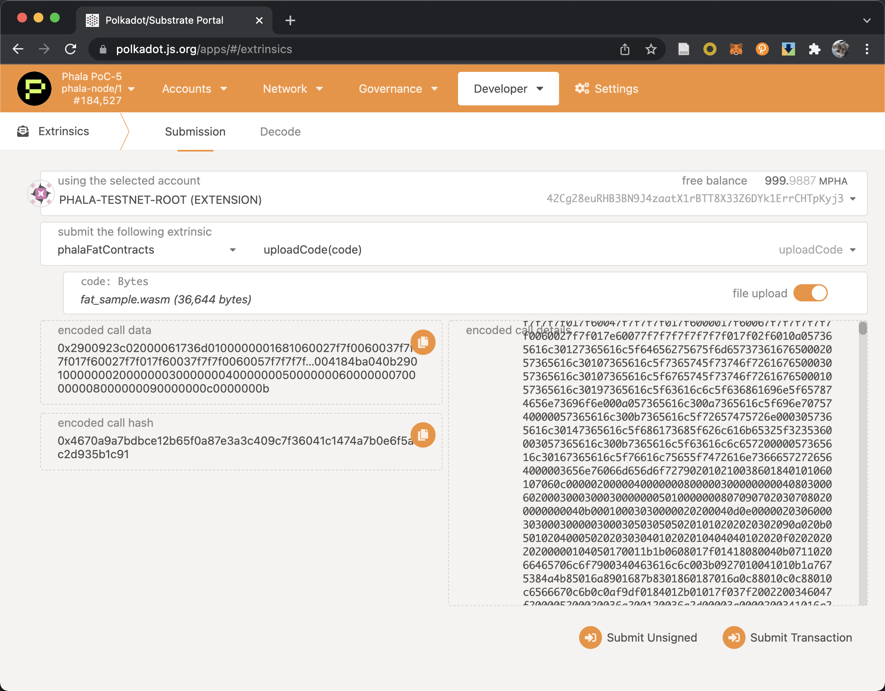
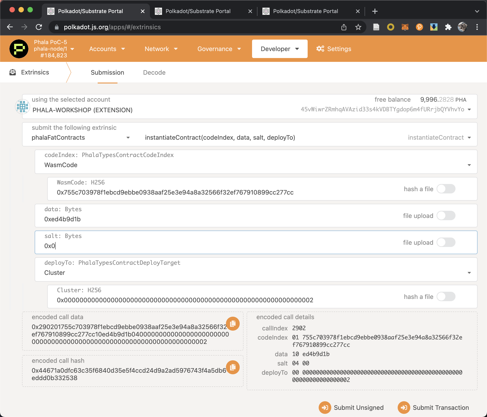

# Fat Contract Workshop

This is a workshop demonstrating how to write a *Fat Contract* with its HTTP request capability on Phala.

## Introduction

Fat Contract is the programming model adopted by Phala Network. Fat Contract is **NOT** smart contract.

Instead, it aims to provide the rich features that ordinary smart contracts cannot offer, including:

- CPU extensive computation: exclusive off-chain execution at the full CPU speed
- Network access: the ability to send the HTTP requests
- Low latency: non-consensus-sensitive operations may not hit the blockchain at all, removing the block latency
- Strong consistency: consensus-sensitive operations remain globally consistent
- Confidentiality: contract state is hidden by default unless you specifically expose it via the read call

Fat Contract is 100% compatible with Substrate's `pallet-contracts`. It fully supports the unmodified ink! smart contracts. Therefore you can still stick to your favorite toolchain including `cargo-contract`,  `@polkadot/contract-api`, and the Polkadot.js Extension.

## About this workshop

This workshop will demonstrate how to use Fat Contract's HTTP request capability to associate a Phala account with a Github user. Such functionality serves as the core for [Decentralized Identity (DID)](https://www.gsma.com/identity/decentralised-identity). Further, we will show how to deploy your contract in [Phala Testnet](https://polkadot.js.org/apps/?rpc=wss%3A%2F%2Fpoc5.phala.network%2Fws#/explorer) and interact with it through our [frontend SDK](https://github.com/Phala-Network/js-sdk).

The Fat Contract "Redeem POAP" links on-chain accounts to Github accounts and then distributes POAP redeem code to the verified users. The simple protocol is listed below:

1. The user should create a Github Gist with a special format with the account id: "This gist is owned by address: 0x01234...."
2. The user submits the raw file URL to the Fat Contract by a _query_ ("https://gist.githubusercontent.com/[username]/[gist-id]/raw/...")
3. The contract then
    - Verifies the URL is valid
    - Fetches the content of the URL (by Fat Contract's HTTP in Query feature)
    - Verifies the account claim in the gist is valid
    - Extracts the Github username from the URL and the account id from the claim
    - Produces an `Attestation` struct with the Github username and the account id, and signs it with a contract-owned key (by Fat Contract's confidentiality and cryptographic feature)
4. The user receives the `SignedAttestation`, and then submit the attestation to the contract by a `redeem` _command_
5. The contract verifies the attestation, and then links the Github username and the account id
6. If the user didn't claim any POAP, it reveals a POAP code to the user after the verification

## Environment Preparation

An operating system of macOS or Linux systems like Ubuntu 18.04/20.04 is recommended for the workshop.
- For macOS users, we recommend to use the Homebrew package manager to install the dependencies
- For other Linux distribution users, use the package manager with the system like Apt/Yum

The following toolchains are needed:

- Rust toolchain
    - Install rustup, rustup is the "package manager" of different versions of Rust compilers: `curl --proto '=https' --tlsv1.2 -sSf https://sh.rustup.rs | sh`
    - This will install `rustup` and `cargo`
- Ink! Contract toolchain
    - Install [binaryen](https://github.com/WebAssembly/binaryen) with
        - Homebrew for macOS: `brew install binaryen`
        - Apt for Ubuntu: `sudo apt install binaryen`
        - or download the [release](https://github.com/WebAssembly/binaryen/releases/tag/version_105) and put it under your $PATH
    - Install contract toolchain: `cargo install cargo-contract --force`
- Install frontend toolchain
    - Node.js (>=v16), follow the [official tutorial](https://nodejs.org/en/download/package-manager/)
    - Yarn (v1): `npm install --global yarn`

Check your installation with

```bash
$ rustup toolchain list
# stable-x86_64-unknown-linux-gnu (default)
# nightly-x86_64-unknown-linux-gnu

$ cargo --version
# cargo 1.58.0 (f01b232bc 2022-01-19)

$ cargo contract --version
# cargo-contract 0.17.0-unknown-x86_64-linux-gnu

$ node --version
# v17.5.0

$ yarn --version
# 1.22.17
```

## Create Polkadot Account to use Phala Testnet

- Install Polkadot.js extension and import the Phala gas account following the [tutorial](https://wiki.phala.network/en-us/general/applications/01-polkadot-extension/)
    - Gas account seed: `misery blind turtle lottery random chalk flight fresh cute vanish elephant defy`
- Connect to Phala Testnet
    - Open https://polkadot.js.org/apps/;
    - Click left top to switch network;
    - Choose `Test Networks` - `Phala(PoC 5)` and click `Switch` at the top;
- Send some coins to your own account (limited, don't be evil);
    - Create your own account following [tutorial](https://wiki.phala.network/en-us/general/applications/01-polkadot-extension/#create-new-account)
    - Send some coins.
    

## **[Deprecated]** Play with our deployed version

> The official contract has been removed after Testnet update. You can deploy your own version and interact with it.

- Frontend: https://phala-js-sdk-example.netlify.app/

    1. Connect your wallet;
    2. Load the deployed contract;
        - Substrate endpoint: `wss://poc5.phala.network/ws`
        - Secure Worker endpoints: `https://poc5.phala.network/tee-api-{n}` (n = 1 to 5)
        - Contract ID: `0x6cad353bad2232931ae7878b2013439bfca2576cd0c0d2c72093dc4c63c68568`
        - ABI: copy from `metadata.json` ([prebuilt copy](https://gist.githubusercontent.com/h4x3rotab/4a55b7c6ac9ad50f2f803a1edc93456e/raw/12e0b2d8afacba2fb8de664744fb64c6ed507290/metadata.json))
    3. Click `Sign a Certificate`, this will generate a certificate to encrypt your traffic to/from the contract;
    4. Follow the instruction, copy the contents and create a *public* Github Gist with it;
    5. Open the **RAW** file, and copy the link;
    
    6. Paste the link to the box and click `Verify`;
    7. The redeem code box in will refresh every 5s. It should show your code once the verification is successful.

## Compile the contract

```bash
cargo +nightly contract build
```

Also test to ensure everything is fine

```bash
cargo +nightly contract test
```

You will find the compile result at `./target/ink`:

```bash
$ ls -h target/ink
# fat_sample.wasm  metadata.json ...
```

## Deploy

Collect the above two files and create the contract in Phala Testnet (PoC 5). The contract deployment can be divided into two steps: code upload and contract instantiation.

We recommend to keep a tab for explorer so you will not miss any historical events.

### Code upload

Choose `Developer` - `Extrinsics`, and select the extrinsic `phalaFatContracts` and `uploadCode`, drag the `fat_sample.wasm` file and send the transaction.



A event of `phalaFatContracts.CodeUploaded` should be observed in the block explorer with the code hash, also you can go to `Developer` - `Chain state` and select the extrinsic `phalaFatContracts` and `code` to see the existing code.

Code upload could failed if the wasm code is already on chain.

### Contract instantiation

Choose `Developer` - `Extrinsics`, and select the extrinsic `phalaFatContracts` and `instantiateCode`. We explain the arguments as follow:
- `codeIndex`: the code to use, choose `WasmCode` and type in the hash of you uploaded code
- `data`: the instantiation argument. We shall call the constructor function of the contract will the specific function selector. This can be found in the `metadata.json` (in this case, `0xed4b9d1b`)
```json
...
    "constructors": [
    {
        "args": [],
        "docs": [],
        "label": "default",
        "payable": false,
        "selector": "0xed4b9d1b"
    }
],
...
```
- `salt`: some random bytes to prevent collision, like `0x0` or `0x1234`
- `deployTo`: we have prepared a cluster with `0x0000000000000000000000000000000000000000000000000000000000000001`. In the future, customized cluster will be enabled.



There are three events to observe, all these events contain your contract ID

- `phalaFatContracts.Instantiating`, the chain has receive your request and start instanting;
- `phalaFatContracts.PubkeyAvailable`, the gatekeeper has generated the contract key to encrypt its state and input/output;
- `phalaFatContracts.Instantiated`, your contract is successfully instantiated.

You can go to `Developer` - `Chain state` and select the extrinsic `phalaFatContracts` and `contracts` to see all the contracts.

> ### Handle instantiation failure
> For now, the contract execution log is not directly available to the developers. Join our [Discord](https://discord.gg/myBmQu5) and we can help forward the Worker logs if necessary.

## Interact with the contract

Phala provides [js-sdk](https://github.com/Phala-Network/js-sdk/tree/ethdenver-2022) to simplified the frontend development. It already contains the frontend for the demo contract, check its [example folder](https://github.com/Phala-Network/js-sdk/tree/ethdenver-2022/packages/example).

Follow the steps to run the frontend

1. Download Phala-Network/js-sdk

    ```bash
    git clone --branch ethdenver-2022 https://github.com/Phala-Network/js-sdk.git
    ```

2. Compile and run the frontend. By default it will serve the app at <http://localhost:3000>:

    ```bash
    cd js-sdk

    yarn
    yarn dev
    ```

You shall see the identical page as we have [deployed](#play-with-our-deployed-version).

> ### Attention
> By default, the `poap_code` pool is empty, so the users can only get empty string even if they have passed the verification. The contract admin need to invoke the `admin_set_poap_code()` first to fill in the redeem code pool so the users can really get something.

## Challenge: Fill in the missing code

We leave two challenges (labeled by `TODO`) for you to explore.
- The first is about adding the necessary access control to the update redeem code function, you will learn about how to access the contract metadata through the `self.env()` function;
- The second is about check to prevent a double redemption of the code.

### Solution

Please check the `ethdenver-2022-solution` branch.

## Appendix

### Resources

- ETHDenver 2022
    - [Workshop live Q&A](https://www.dory.app/c/a80ff472/998bb98b_phala-network-workshop-2-15/questions)
    - [Hackathon Repo](https://github.com/Phala-Network/ETHDenver-2022)
    - [FAQ list](https://docs.google.com/document/d/1SRyJss5oNf_szan3Hbtf9MyKrE24aSAV5degd7ES0JY/edit?usp=sharing)
    - Prebuilt [Redeem POAP App](https://phala-js-sdk-example.netlify.app/)
- [JS SDK (with the UI scaffold)](https://github.com/Phala-Network/js-sdk)
    - [SDK docs](https://github.com/Phala-Network/js-sdk/tree/main/packages/sdk)
    - [Scalffold docs](https://github.com/Phala-Network/js-sdk/tree/main/packages/example)
- [ink! Docs](https://paritytech.github.io/ink-docs/)
- [Polkadot.js Docs](https://polkadot.js.org/docs)
- Join [Discord](https://discord.gg/phala) #dev and #hackathon groups!

### Endpoints

- Chain: `wss://poc5.phala.network/ws`
    - Polkadot.js quick link: https://polkadot.js.org/apps/?rpc=wss%3A%2F%2Fpoc5.phala.network%2Fws#/explorer
- Workers (with their identity key)
  - https://poc5.phala.network/tee-api-1
      - 0x94a2ded4c77fbb910943f7e452e4d243ee5b60bf1a838a911acf2ffd4bae9b63
  - https://poc5.phala.network/tee-api-2
      - 0x50ede2dd7c65716a2d55bb945dfa28d951879154f832e049851d7882c288db76
  - https://poc5.phala.network/tee-api-3
      - 0xfe26077a6030e505136855100f335503ca40f6e8afa149b0c6c618e81c1cb53b
  - https://poc5.phala.network/tee-api-4
      - 0x6cfc1282880305c7691f0941b98089b9da17acde43b66ef2220022797bb3e370
  - https://poc5.phala.network/tee-api-5
      - 0xbed94c30d660a1de5a499e38f9f3afe9ccc1ef5f901530efd48de641679fbc7d
